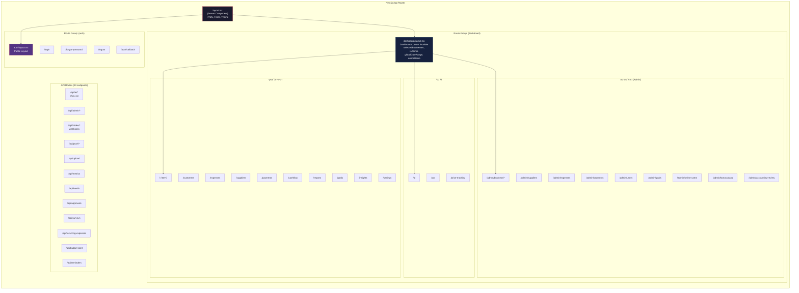
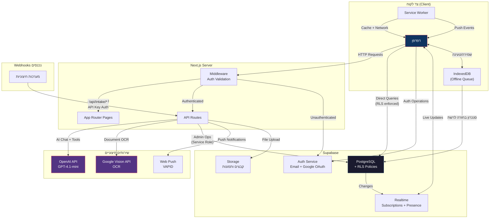
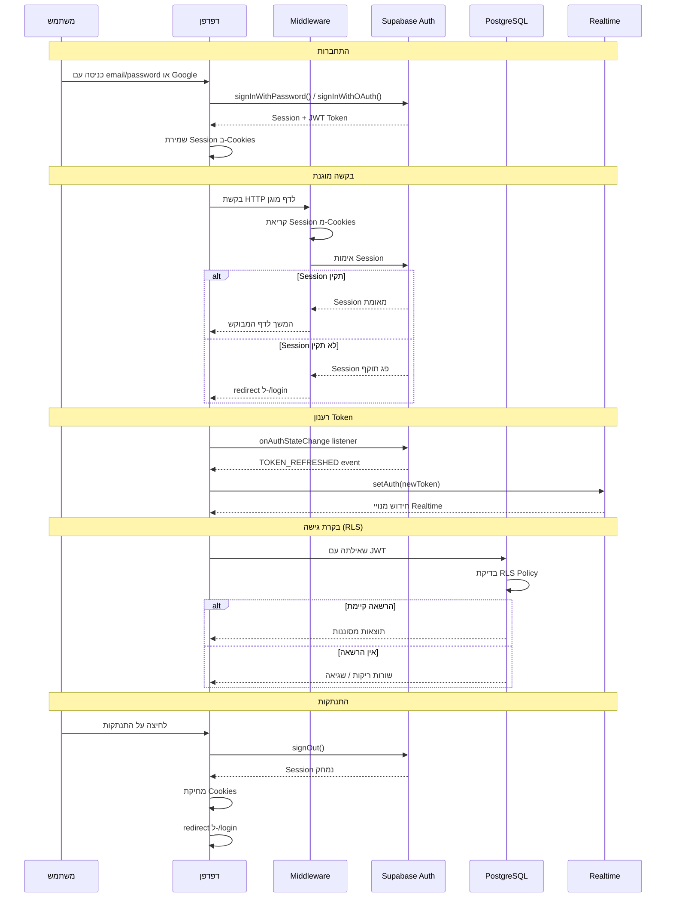
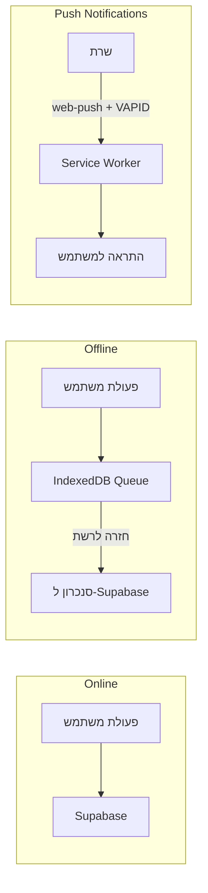

# ארכיטקטורת מערכת - המצפן (Amazpen)

## סקירה כללית

המצפן היא אפליקציית SaaS לניהול עסקי בעברית (RTL), המיועדת למעקב אחר מדדים פיננסיים, הוצאות, יעדים, ספקים ותובנות מבוססות AI.
האפליקציה בנויה על Next.js 16 עם App Router, React 19 ו-TypeScript 5.9 (strict mode).

### סטאק טכנולוגי

| שכבה | טכנולוגיה |
|------|-----------|
| Framework | Next.js 16 (App Router, Turbopack) |
| UI | React 19, Tailwind CSS 4, Radix UI, shadcn/ui |
| מסד נתונים | Supabase (PostgreSQL, Auth, Realtime, Storage) |
| AI | OpenAI GPT-4.1-mini, Vercel AI SDK |
| Deployment | Docker (node:20-alpine), Dokploy/Traefik |
| PWA | Service Worker, Web Push, IndexedDB |

---

## דיאגרמת קומפוננטות ו-Route Groups



---

## ניהול State

### DashboardContext

ה-Context המרכזי של האפליקציה מוגדר ישירות ב-`src/app/(dashboard)/layout.tsx`:

```
DashboardContext
├── selectedBusinesses    // בחירת עסקים מרובים
├── isAdmin               // בדיקת הרשאת admin
├── globalDateRange       // טווח תאריכים גלובלי
├── onlineUsers           // משתמשים מחוברים (presence)
└── refreshProfile()      // רענון פרופיל משתמש
```

גישה דרך hook: `useDashboard()`

### Custom Hooks

| Hook | תפקיד |
|------|--------|
| `useRealtimeSubscription` | מנוי ל-Supabase Realtime |
| `useOfflineSync` | סנכרון offline עם IndexedDB |
| `useApprovals` | מערכת אישורים |
| `usePresence` | נוכחות משתמשים בזמן אמת |
| `useFormDraft` | שמירת טיוטות בטפסים (IndexedDB) |
| `usePersistedState` | state ב-localStorage |
| `usePushSubscription` | מנוי להתראות Push |
| `useWakeLock` | מניעת כיבוי מסך |
| `useOnboarding` | סיורי הדרכה |
| `use-mobile` | זיהוי breakpoint רספונסיבי |

### Supabase Clients

| Client | קובץ | שימוש |
|--------|-------|-------|
| Browser | `src/lib/supabase/client.ts` | Singleton, גישת דפדפן |
| Server | `src/lib/supabase/server.ts` | Per-request, עם Cookies |
| Middleware | `middleware.ts` | בדיקת auth בכל בקשה |

---

## דיאגרמת זרימת נתונים



### סוגי זרימות נתונים

#### 1. גישה ישירה ל-Supabase (עם RLS)
הלקוח מבצע שאילתות ישירות למסד הנתונים דרך ה-SDK של Supabase.
בקרת גישה נאכפת ברמת מסד הנתונים באמצעות Row Level Security (RLS).

```
Client --> Supabase SDK --> PostgreSQL (RLS enforced)
```

#### 2. פעולות Admin דרך API Routes
פעולות ניהוליות עוברות דרך API Routes שמשתמשים ב-Service Role Client:

```
Client --> /api/admin/* --> Supabase (Service Role, no RLS)
```

#### 3. Webhooks נכנסים
מערכות חיצוניות שולחות נתונים דרך endpoints ייעודיים עם אימות API Key:

```
External System --> /api/intake/* --> apiAuth.ts validation --> DB
```

#### 4. Supabase Realtime
עדכונים בזמן אמת זורמים מ-Supabase ללקוח:

```
DB Change --> Supabase Realtime --> Client (useRealtimeSubscription)
```

#### 5. סנכרון Offline
כשאין חיבור לרשת, פעולות נשמרות ב-IndexedDB ומסונכרנות בחזרה:

```
User Action --> IndexedDB Queue --> (network restored) --> Supabase
```

---

## דיאגרמת זרימת אימות (Authentication)



### תפקידים ו-RLS

| תפקיד | הגדרה | גישה |
|--------|--------|------|
| `admin` | ניהול מלא | כל העסקים והמשתמשים |
| `owner` | בעל עסק | העסק שלו + עובדים |
| `employee` | עובד | צפייה מוגבלת בעסק |

תפקידים מאוחסנים בטבלת `business_members` ונבדקים ברמת RLS.
מדיניות RLS מפוצלת תמיד ל-SELECT/INSERT/UPDATE/DELETE נפרדים (לעולם לא `FOR ALL`).

---

## מערכת AI

### זרימת שיחה

```
לקוח --> /api/ai/chat --> Rate Limiter (20 req/min)
                       --> OpenAI GPT-4.1-mini (streaming)
                       --> Tool Calls --> Supabase
                       --> UIMessageStreamResponse --> לקוח
```

### כלי AI (Tool Calls)

| כלי | תפקיד |
|-----|--------|
| `getMonthlySummary` | סיכום חודשי של הכנסות והוצאות |
| `queryDatabase` | שאילתות SQL לקריאה בלבד |
| `getBusinessSchedule` | לוח זמנים שבועי של העסק |
| `getGoals` | יעדים ומטרות עסקיות |
| `calculate` | חישובים פיננסיים |
| `proposeAction` | הצעת פעולות עם אישור משתמש |

### שמירת שיחות

שיחות AI נשמרות בשתי טבלאות:
- `ai_chat_sessions` - מטא-דאטה של שיחה
- `ai_chat_messages` - הודעות בודדות

---

## מערכת OCR

### זרימת עיבוד מסמכים

```
העלאת מסמך --> /api/ai/ocr
                  |
                  ├── תמונה --> Google Vision API --> חילוץ טקסט
                  |
                  └── PDF --> pdfjs-dist --> המרה לתמונה --> Sharp --> Google Vision API
                                                                         |
                                                                         v
                                                                    פריטים מובנים
                                                                         |
                                                                         v
                                                                  תור מסמכים (UI)
                                                                         |
                                                              ┌──────────┼──────────┐
                                                              v          v          v
                                                           אישור     עריכה     דחייה
```

### רכיבי OCR

| רכיב | מיקום | תפקיד |
|------|-------|--------|
| Document Queue | `src/components/ocr/` | ממשק ניהול תור מסמכים |
| PDF Viewer | `src/components/ocr/` | צפייה ב-PDF |
| OCR API | `/api/ai/ocr` | עיבוד מסמכים דרך Google Vision |
| PDF to Image | `src/lib/pdfToImage.ts` | המרת PDF לתמונות |

---

## PWA ו-Offline

### Service Worker

קובץ: `public/sw.js`

**אסטרטגיית Cache:**
- Network-first: ניסיון לרשת קודם, fallback ל-cache
- Cache busting: חותמת זמן build מוזרקת דרך `next.config.ts`

### תמיכת Offline



### רכיבי PWA

| רכיב | תפקיד |
|------|--------|
| `InstallPrompt` | הנחיית התקנת PWA |
| `UpdatePrompt` | הנחיית עדכון גרסה |
| `usePushSubscription` | ניהול מנויי Push |
| `useOfflineSync` | סנכרון תור offline |
| `useWakeLock` | מניעת כיבוי מסך |

---

## Deployment

### Docker Multi-stage Build

```
Stage 1: deps
├── node:20-alpine
├── npm ci (dependencies only)
└── Output: node_modules

Stage 2: builder
├── Copy source code
├── npm run build
├── output: 'standalone'
└── Output: .next/standalone

Stage 3: runner
├── node:20-alpine (minimal)
├── Copy standalone output
├── EXPOSE 3001
└── CMD: node server.js
```

### תשתית

```
GitHub Repo --> Dokploy --> Docker Build --> Container
                                              |
                                              v
                                         Traefik (Reverse Proxy + SSL)
                                              |
                                              v
                                         Port 3001
```

**פורט:** 3001 (כדי להימנע מהתנגשות עם Dokploy).
**Output mode:** `standalone` לאופטימיזציה של Docker image.

---

## מבנה ספריות

```
src/
├── app/
│   ├── layout.tsx                    # Root layout (Server Component)
│   ├── (auth)/                       # דפי אימות ציבוריים
│   │   ├── layout.tsx
│   │   ├── login/
│   │   ├── forgot-password/
│   │   ├── logout/
│   │   └── auth/callback/
│   ├── (dashboard)/                  # דפים מוגנים
│   │   ├── layout.tsx                # DashboardContext
│   │   ├── page.tsx                  # דף ראשי
│   │   ├── customers/
│   │   ├── expenses/
│   │   ├── suppliers/
│   │   ├── payments/
│   │   ├── cashflow/
│   │   ├── reports/
│   │   ├── goals/
│   │   ├── insights/
│   │   ├── ai/
│   │   ├── ocr/
│   │   ├── price-tracking/
│   │   ├── settings/
│   │   └── admin/
│   │       ├── business/
│   │       ├── suppliers/
│   │       ├── expenses/
│   │       ├── payments/
│   │       ├── users/
│   │       ├── goals/
│   │       ├── online-users/
│   │       ├── bonus-plans/
│   │       └── accounting-review/
│   └── api/                          # 33 API endpoints
│       ├── admin/
│       ├── ai/
│       │   ├── chat/
│       │   └── ocr/
│       ├── approvals/
│       ├── intake/
│       ├── push/
│       ├── upload/
│       ├── metrics/
│       ├── health/
│       ├── surveys/
│       ├── recurring-expenses/
│       ├── budget-alert/
│       ├── reminders/
│       ├── retainers/
│       ├── suppliers/
│       ├── daily-push/
│       ├── weekly-summary/
│       ├── bonus-push/
│       ├── missing-invoices/
│       └── upcoming-payments/
├── components/
│   ├── ui/                           # shadcn/ui primitives
│   ├── dashboard/                    # ווידג'טים ומודלים
│   ├── ai/                           # ממשק צ'אט AI
│   ├── ocr/                          # סריקת מסמכים
│   └── onboarding/                   # סיורי הדרכה
├── hooks/                            # Custom React hooks
├── lib/                              # Utilities + Supabase clients
└── types/                            # TypeScript type definitions
```

---

## משתני סביבה

| משתנה | סוג | תפקיד |
|-------|------|--------|
| `NEXT_PUBLIC_SUPABASE_URL` | Build-time | כתובת Supabase |
| `NEXT_PUBLIC_SUPABASE_ANON_KEY` | Build-time | מפתח Anon |
| `NEXT_PUBLIC_DISABLE_REALTIME` | Build-time | כיבוי Realtime |
| `NEXT_PUBLIC_VAPID_PUBLIC_KEY` | Build-time | מפתח VAPID להתראות |
| `SUPABASE_SERVICE_ROLE_KEY` | Runtime | מפתח Service Role |
| `OPENAI_API_KEY` | Runtime | מפתח OpenAI |

---

## קישורים

- [סטנדרטים ודפוסי קוד](./code-standards.md)
- [סכמת מסד נתונים](./database-schema.md)
